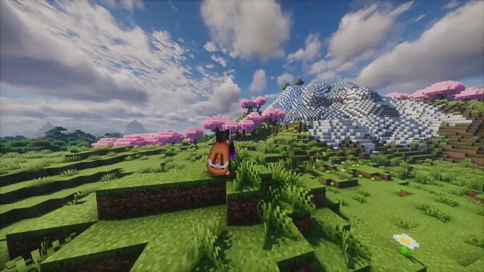

  
  
  

## Unparalleled visual precision with buttery-smooth camera zooming

Upgrade your standard field of view into a professional camera tool. Ji Zoom Cinematic provides dynamic, easing-based zoom mechanics designed for precise terrain scouting, capturing detailed screenshots, and recording flawless video footage without rigid transitions.

Whether you are focusing on a distant structure or tracking a moving target, your view adjustments are now fluid, responsive, and completely customizable.
 

---

## ✨ **Core Features**

- **Dynamic Easing** — Fluid FOV transitions when zooming in and out, eliminating sudden graphical snaps.  
- **Scroll to Adjust** — Dynamically control your magnification level on the fly using the mouse scroll wheel.  
- **Cinematic Integration** — Automatically synchronizes with Minecraft's cinematic camera for ultra-smooth panning while zoomed.  
- **Uncapped Magnification** — Push beyond standard optical limits with configurable maximum zoom depths.  
- **Zero Latency** — Highly optimized to ensure stable framerates even during rapid zoom adjustments.  
 

---

## Flawless zoom mechanics for content creation and exploration

---

## ⚙️ **Advanced Configuration**

Fully customizable in-game menu (Mod Menu support):  
• Zoom keybind mode (Hold vs. Toggle)  
• Transition speed and easing type  
• Minimum and maximum scroll zoom limits  
• Cinematic camera auto-toggle  

**Languages:** English + Español (LatAm & Spain)
 

---

**Requirements & Supported Versions**

**Supported Minecraft Versions:**
`1.21` - `1.21.11`

| Loader / Dependency | Version required | Status                                  |
| ------------------- | ---------------- | --------------------------------------- |
| **Fabric Loader**   | Matches your MC  | 🔴 **Required**                         |
| **Fabric API**      | Latest available | 🔴 **Required**                         |
| **Mod Menu**        | Latest available | 🟢 *Recommended* (For in-game settings) |

**🎮 100% Client-Side** — Functions on any server architecture (Vanilla, Paper, Realms, etc.). No server-side installation required.
 
